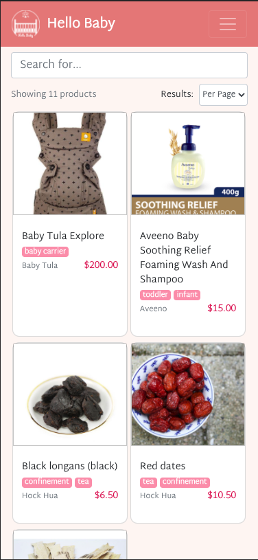
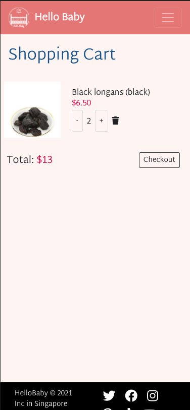
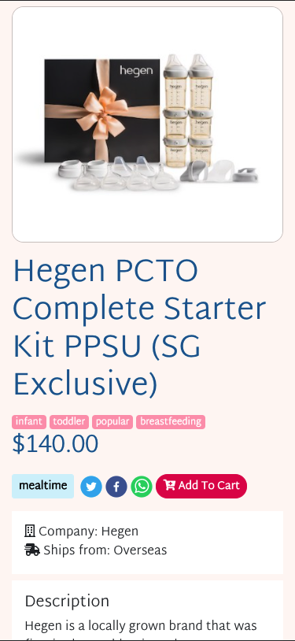
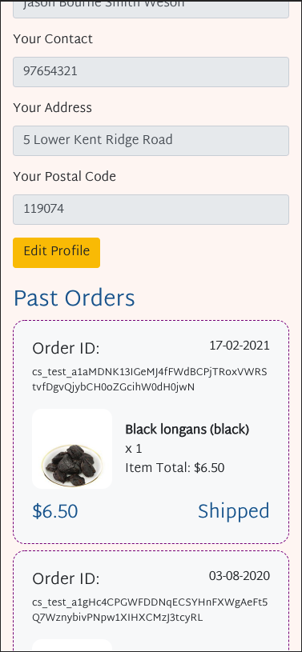
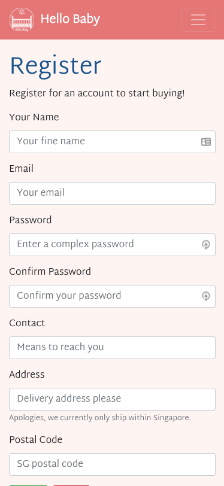
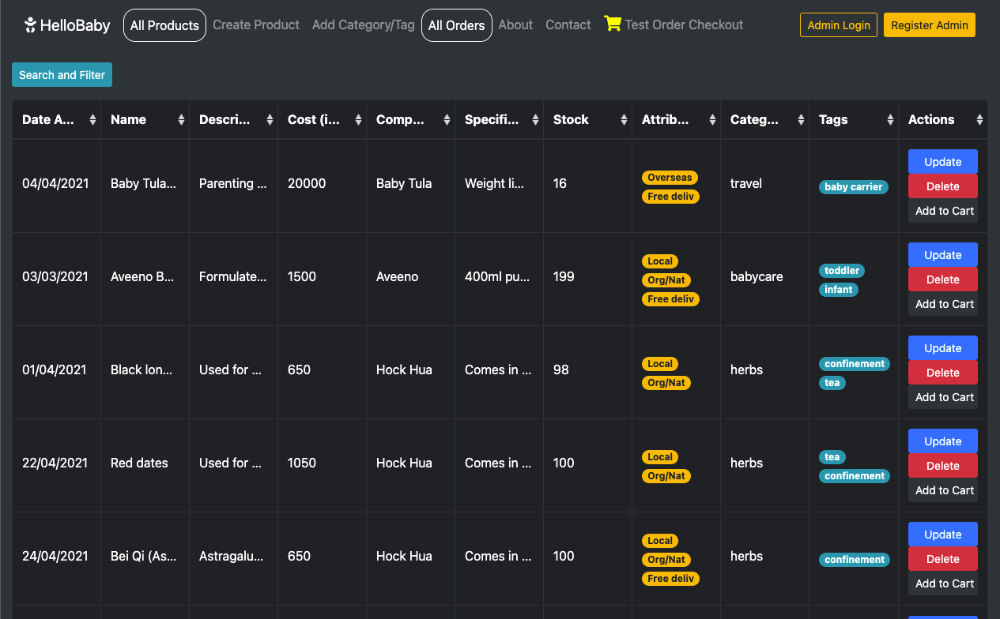
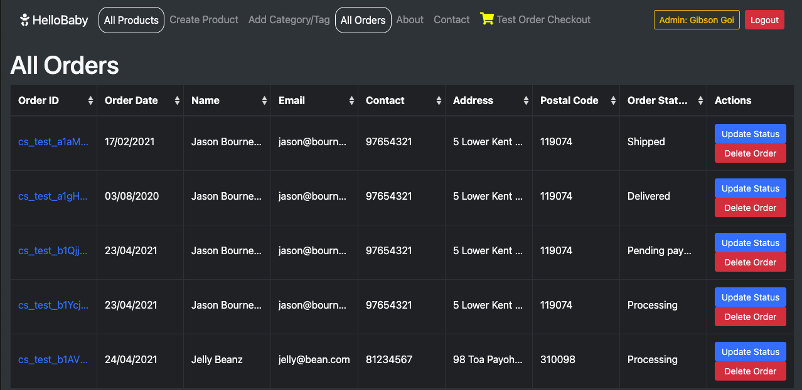
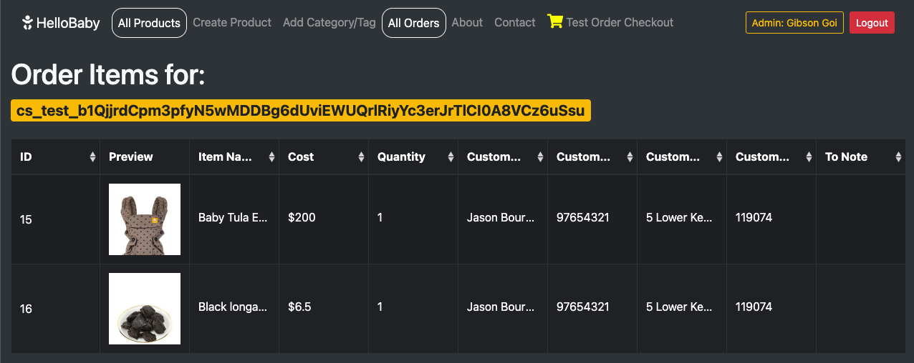
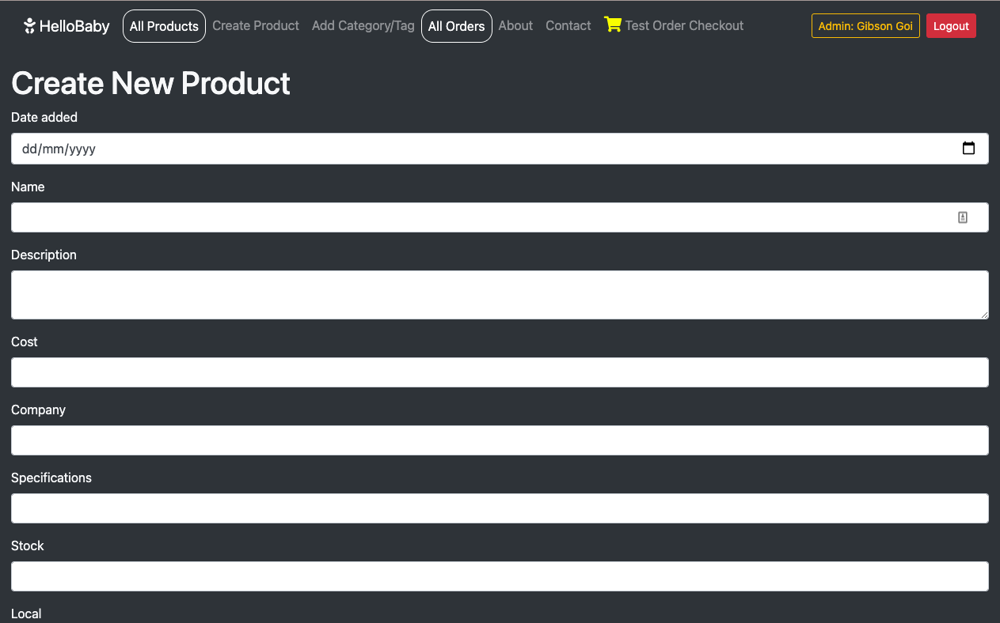

# How to Use

- HelloBaby can be accessed at [https://focused-panini-18207b.netlify.app/](https://focused-panini-18207b.netlify.app/).
- HelloBaby's backend (built on expressjs) can be accessed at [https://ancient-fortress-09431.herokuapp.com/](https://ancient-fortress-09431.herokuapp.com/). APIs are also stored here.

This app consists of a frontend shopping cart and a backend system for managing products in the "shop". A summary of its functions are below:

## Backend

1. Login and Logout system for vendors to manage their products:
   - Create new products, and upload an image (via UploadCare). Also allows associating a product with categories (one-to-many) and tags (many-to-many).
   - View all products in the shop.
   - Update an existing product.
   - Delete an existing product.
2. Add new categories and tags without needing to go into the database.
3. Manage orders:
   - Update status of each order (pending payment, processing, shippped, delivered).
   - Delete an order.
   - See details of each order (items that customer purchased).
4. Order mechanism:
   - When a customer checks out their cart, an order will be created and status set to "Pending Payment".
   - After checkout is completed, backend is notified (via Stripe webhook), order status is immediately changed to "Processing".
   - Vendor may change the order status after the order is shipped or delivered.
   - This status will be immediately reflected in the customer's "Order History" (on their profile page).
5. Testing a shopping cart checkout (via backend).
6. Registering of a new admin account.

## Frontend

1. Customers can browse a list of products that the shop offers.
   - They can also do a search (case insensitive);
   - And change the number of results that they would like to view per page. This would dynamically change the number of pages available.
2. Customers can filter by categories using the menu buttons.
3. Shopping cart validation:
   - To only allow logged in customers to add an item to cart.
   - To only add an item to cart when the quantity is more than 0.
4. Social media functions to allow customers to share the product page with Twitter, Facebook and WhatsApp.
5. Customers interested to purchase items can register for an account:
   - Registration form has validation for required fields;
   - Password confirmation; and
   - Password complexity (must have at least 5 characters, one uppercase character and one lowercase character.)
   - Upon submission, customer is immediately logged in to their account to start shopping.
6. Customer can start adding items to their shopping cart upon logging in.
7. Customer can view their shopping cart, and adjust the quantity that they would like to purchase:
   - When the quantity is reduced from 1 to 0, the item is immediately removed from the cart.
   - Customers can directly remove the item from the shopping cart as well.
   - The shopping cart is always kept updated in the database so it is always retrievable, even if the customer logs out and logs back in again.
8. Upon clicking "Checkout", customers will be brought to Stripe to complete their checkout.
9. After completing payment, customers will be shown an Order Confirmation page, with a list of items ordered, and the ability to print the page.
10. Customers can navigate to their profile page to see a list of all their current and past orders.
11. Customers can also update their name, email, address and contact via their profile page.
12. For security purposes, upon logging out, the customer's access tokens will be cleared and will require them to log back in again to start a new session.

# Project Summary

HelloBaby is a secure, one-stop place for new mummies and daddies to buy all that they need to prepare for their newborn. From confinent nanny services, to herbs needed, to mummy and babycare, as well as travel systems, HelloBaby is the first and only place that you need to go to welcome your previous newborn!

# Strategy

There are many online mother and babycare shops available. There are dedicated online shops (e.g. Mothercare) or you can navigate to popular shopping platforms like Lazada to purchase such items. However, there is currently no _curated_ list of items **and** services that parents can browse. HelloBaby hopes to fill this gap, and build a trusted brand so that this will be the only place that parents need to visit when they are going to welcome a newborn.

## User Stories

As a vendor:

1. I want to be able to manage (create, view, update and delete) the products that I am selling.
2. I want to add in new categories and tags that are currently not in the system, so I do not need a system administrator to do it.
3. I want to be able to keep track of the orders that come in, so that I:
   - Ship out only orders that have been paid;
   - Mark orders as delivered when I'm notified by my logistics company;
   - Can keep my customer updated on his order status, without him/ her needing to contact me.
   - But if there is a need to, check the specific items related to each order, when they call me.
   - Delete orders when needed.
4. I want to be able to test that my shopping cart and checkout system is working properly.

As a customer:

1. I want to browse a list of products that the shop offers.
2. I want to be able to do a search of the products available.
3. I want to change the number of results that I can view on the page, so that I can better navigate.
4. I want to be able to filter the products by categories.
5. I want to add products I like to my shopping cart for purchase.
6. I want to be able to increase or decrease the quantity of each item bought in my shopping cart, as well as remove each item.
7. I want to be able to checkout the items in my shopping cart, and see an order confirmation after payment is completed. I also want to be able to print out this order confirmation for record keeping purposes.
8. I want to be able to share products I like with my friends through Twitter, Facebook and Whatsapp.
9. I want to be able to see a list of my past orders and specific items in those orders.
10. I want to be able to update my profile, such as my name, address, and contact.
11. I want to be able to log out so that other users of my device cannot purchase items. However, when I log back in on the same device or another device, items that I've already added to my shopping cart should be there.

# Scope

The app must be able to perform the following functions:

- Allow users to employ a variety of search and filter methods to locate the resource they need.
- Allow a user to register, log in and log out.
- Users' passwords must be hashed before storing on the database.
- Allow a user to edit their details on their own dashboard.
- For accountability purposes, to only allow registered users to contribute new resources.
- Allow registered users to edit not only their own contributions, but those of others as well.
- To encourage resources to be vetted as much as possible, allow non-registered users to contribute reviews.
- Each resource should contain critical information, including a map to allow easy location of resource.

# Skeleton

### Frontend







### Backend






# Code style

Code is formatted using Prettier (installed as an extension in VS Code).
[](https://github.com/prettier/prettier)

# Deployment

HelloBaby's shopfront is deployed to Netlify. Its backend is deployed to Heroku. The SQL database used is Postgres as supplied by Heroku.

### Deploying the shopfront

After cloning the repository, ensure that the folder and files are in the root directory (e.g. same directory as your .git directory). You may then proceed to log in to your [Netlify](https://www.netlify.com) and deploy a new site from Github. Select your Github directory and Netlify will proceed to deploy your site.

Ensure the following is set up in the Environment Variables within your Netlify site's settings.

```
REACT_APP_STRIPE_SECRET_KEY
```

### Deploying the backend

After cloning the repository, ensure that the folder and files are in the root directory (e.g. same directory as your .git directory). Using [Heroku's CLI tool](https://devcenter.heroku.com/articles/heroku-cli), proceed to use your terminal to link your repository with Heroku. Before pushing to Heroku (using `git push heroku master` OR `git push heroku <branch>`), ensure that the following is done:

- Your .gitignore file is properly configured to include `node_modules` and any `.env` files.
- A **Procfile** has been created and contains the following: `web: node index.js`.
- The version of Node is included in your `package.json` file:

```
"engines": {
    "node": "14.x"
  }
```

- After creaing the app on Heroku using `heroku create`, set up your **config variables** in the settings section of your application in Heroku. It should contain the variables for the following:

```
UPLOADCARE_PUBLIC_KEY
DB_DRIVER
DB_USER
DB_PASSWORD
DB_DATABASE
DB_HOST
SESSION_SECRET_KEY
STRIPE_PUBLISHABLE_KEY
STRIPE_SECRET_KEY
STRIPE_SUCCESS_URL
STRIPE_ERROR_URL
STRIPE_ENDPOINT_SECRET
TOKEN_SECRET
REFRESH_TOKEN_SECRET
```

For further details, please refer to the awesome [guide](https://devcenter.heroku.com/articles/deploying-nodejs) on Heroku's website.

# Tech/frameworks Used

This app is made only possible thanks to the following technologies:

Backend:

- body-parser
- bookshelf
- uploadcare
- connect-flash
- cors
- csurf
- db-migrate
- db-migrate-mysql
- db-migrate-pg
- dotenv
- express
- express-session
- forms
- handlebars-helpers
- hbs
- jsonwebtoken
- knex
- moment
- mysql2
- pg
- session-file-store
- stripe
- wax-on

Frontend:

- stripe
- axios
- bootstrap
- joi
- react
- react-dom
- react-router-dom
- react-scripts
- react-share
- reactstrap

Built with [VS Code](https://code.visualstudio.com/)

# Acknowledgments

- Mr Paul Chor
- Mr Alexander Yan
- My wonderful classmates who have been part of this journey together:
  - Hidayah
  - Howard
  - Julius
  - Ying Ru
  - BIG THANKS to **Ryan** for helping me create the beautiful HelloBaby logo

# Testing

| Category | Cases | Expected Outcome |
| -------- | ----- | ---------------- |
